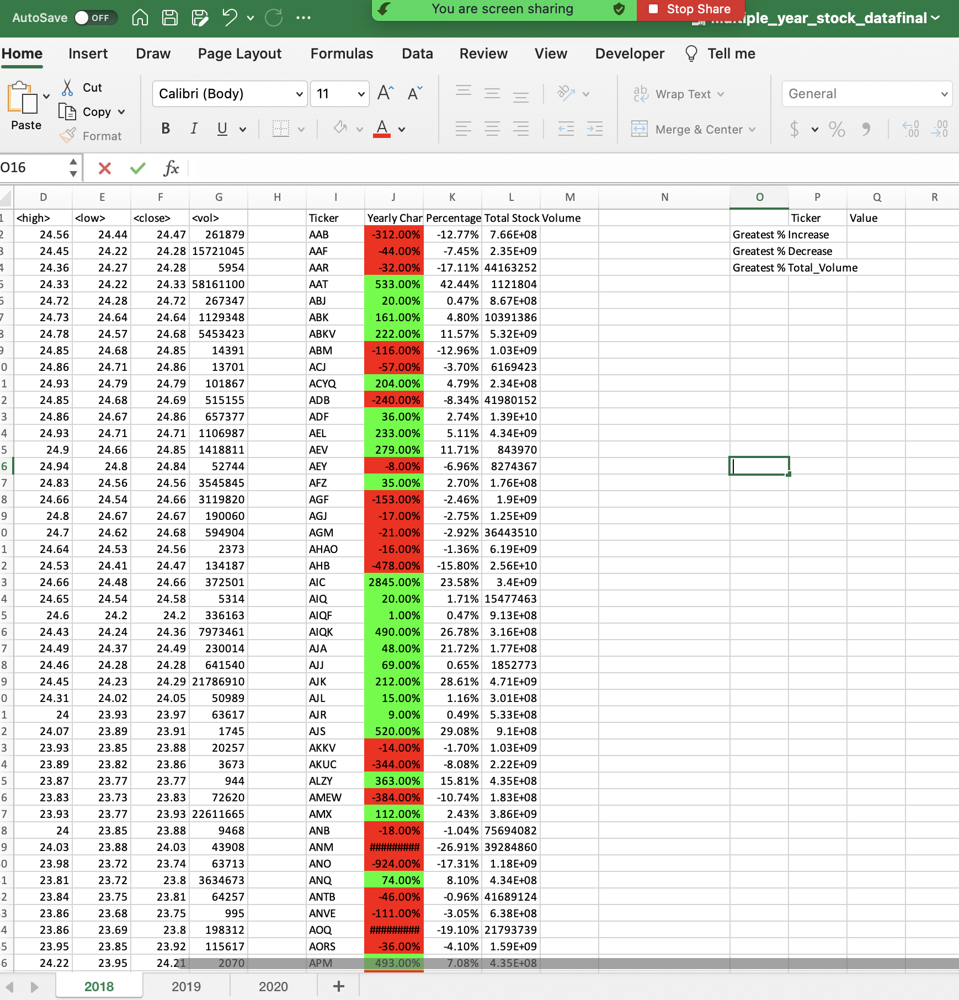

# VBA-Challenge
This file includes the analysis for stock volume.  i have used as code source VBA for dummies book,  Ask bcs learning assistance 3 sections and One section of personal tutoring.  in addition to  Excel vba youtube videos.
below is the link for the challege assignement for your convenience.
https://github.com/Carmenwiggins/VBA-Challenge/edit/main/README.md
google drive link for excel workbook https://docs.google.com/spreadsheets/d/1VZ3NtkE1VG2m1DbF3J9epHQsmVImPwkv/edit?usp=drive_link&ouid=105729207195358828119&rtpof=true&sd=true

